# 渔鱼宝可梦图鉴（PokeAnalytics）- 宝可梦数据分析平台后端

渔鱼宝可梦图鉴是一个功能完备的宝可梦数据分析平台，本仓库包含该平台的后端服务代码。该项目采用微服务架构设计，为用户提供宝可梦图鉴查询、对战数据分析、队伍管理和AI战术分析等功能，帮助宝可梦训练师更好地了解宝可梦数据和制定战术策略。

## 项目地址

**在线访问地址：** [yuyuwang.online](http://yuyuwang.online)

## 项目截图

<div align="center">

### 🏠 系统首页
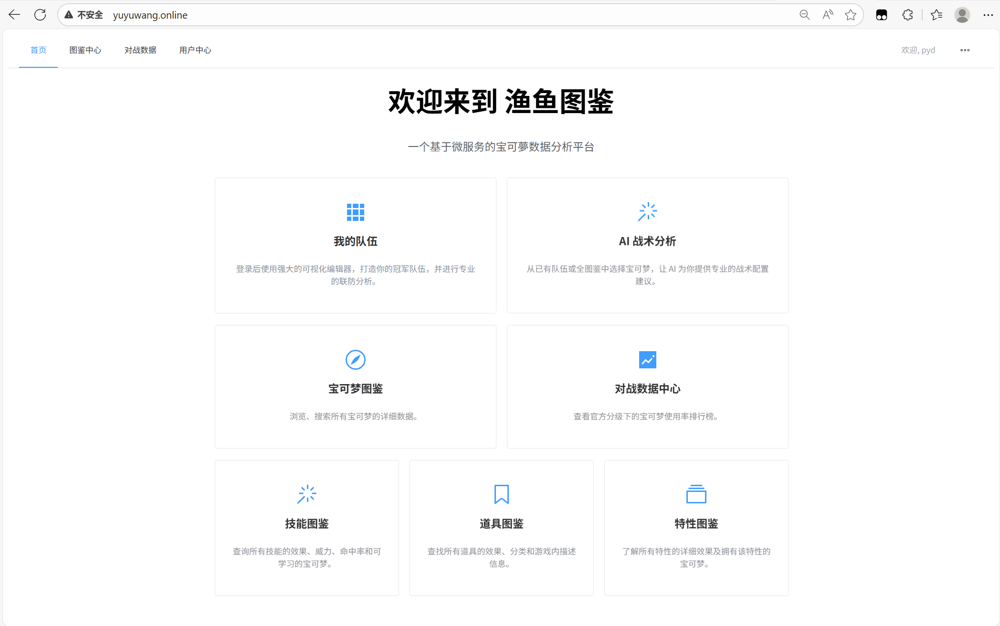

### 📊 对战数据功能
<table>git
  <tr>
    <td>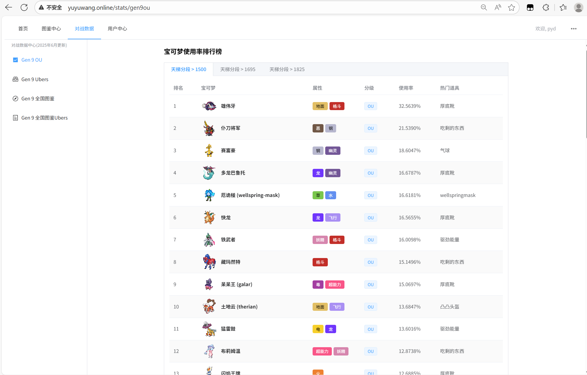</td>
    <td>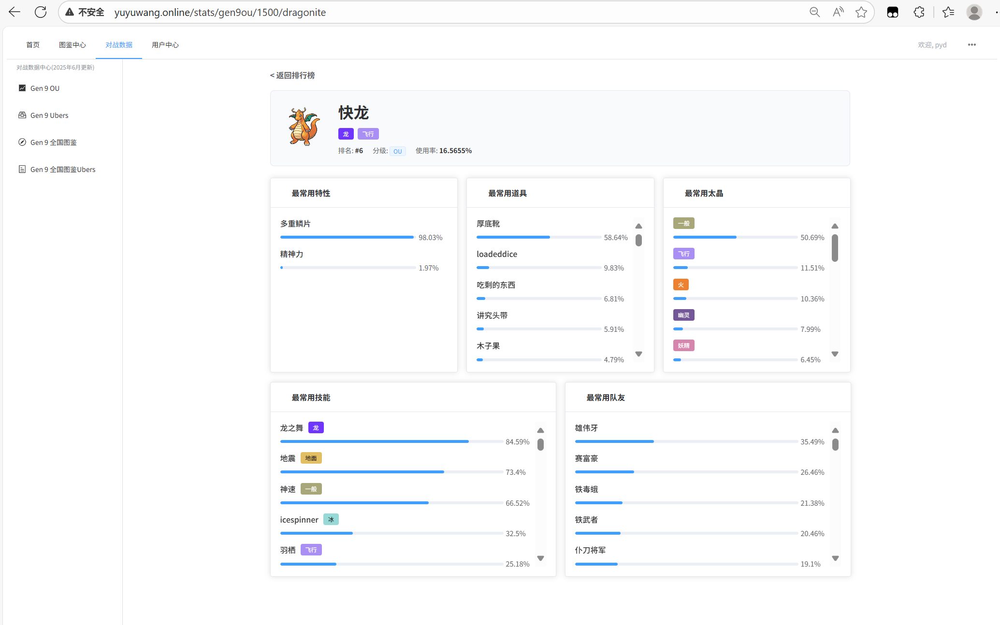</td>
  </tr>
</table>

### 🎯 宝可梦图鉴功能
<table>
  <tr>
    <td>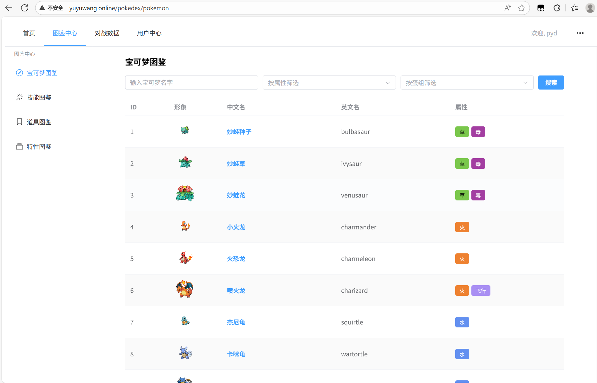</td>
    <td>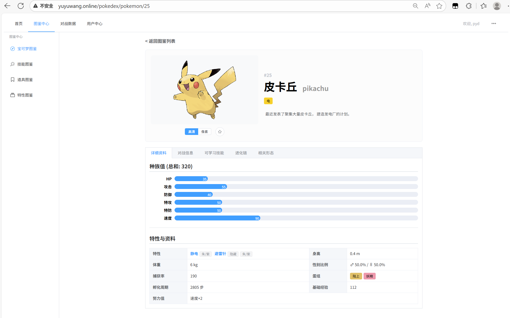</td>
  </tr>
  <tr>
    <td>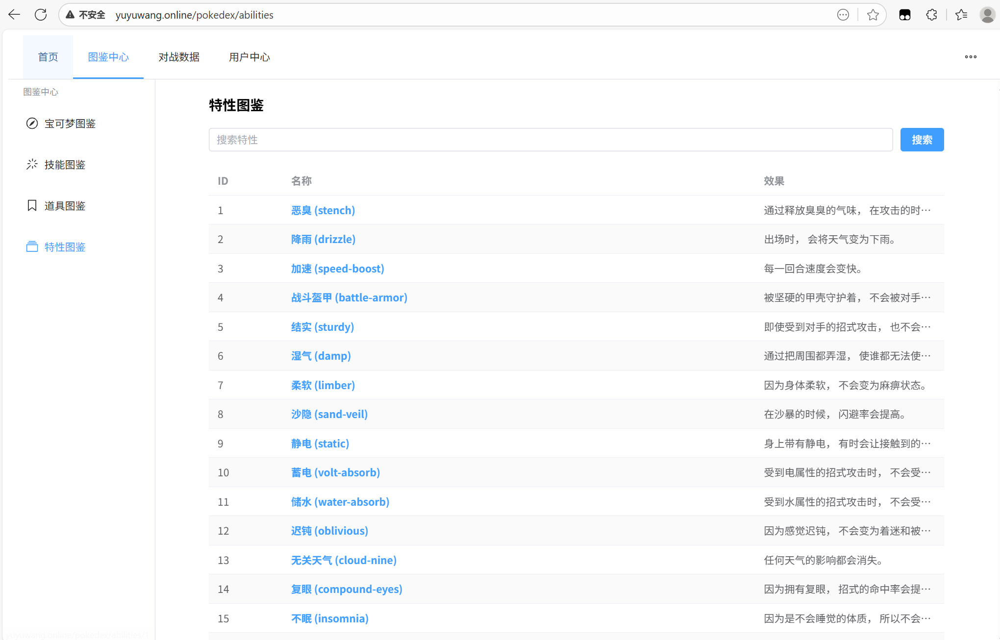</td>
    <td>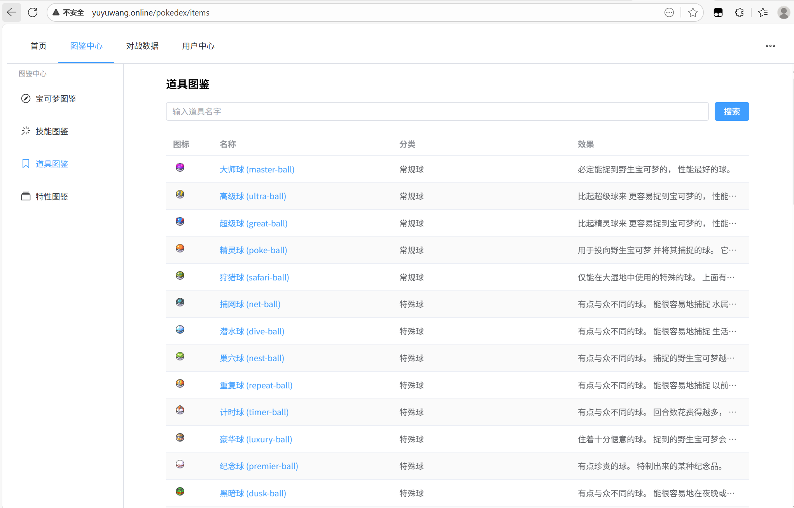</td>
  </tr>
</table>

### 👥 队伍管理与AI分析
<table>
  <tr>
    <td>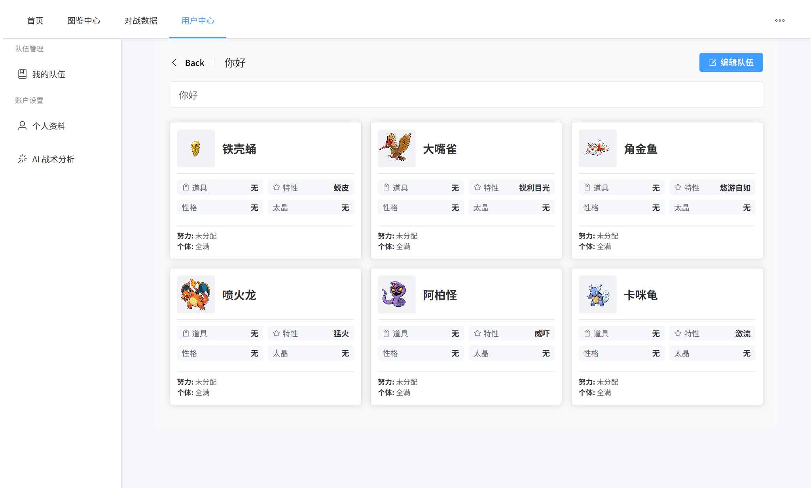</td>
    <td>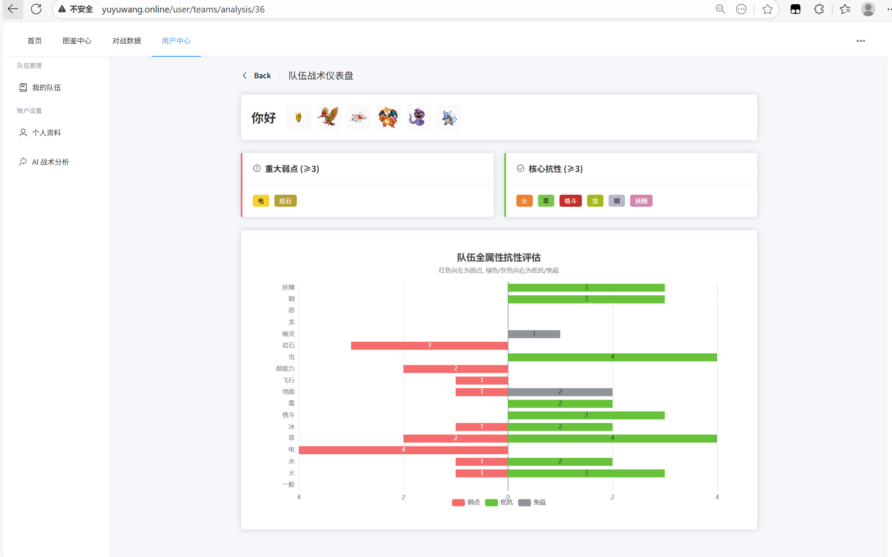</td>
  </tr>
  <tr>
    <td colspan="2" align="center">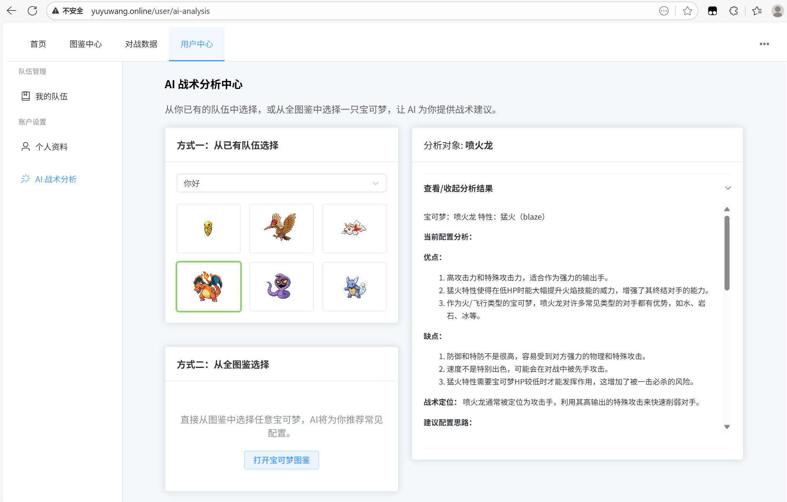</td>
  </tr>
</table>

### 🔐 用户认证
<table>
  <tr>
    <td align="center">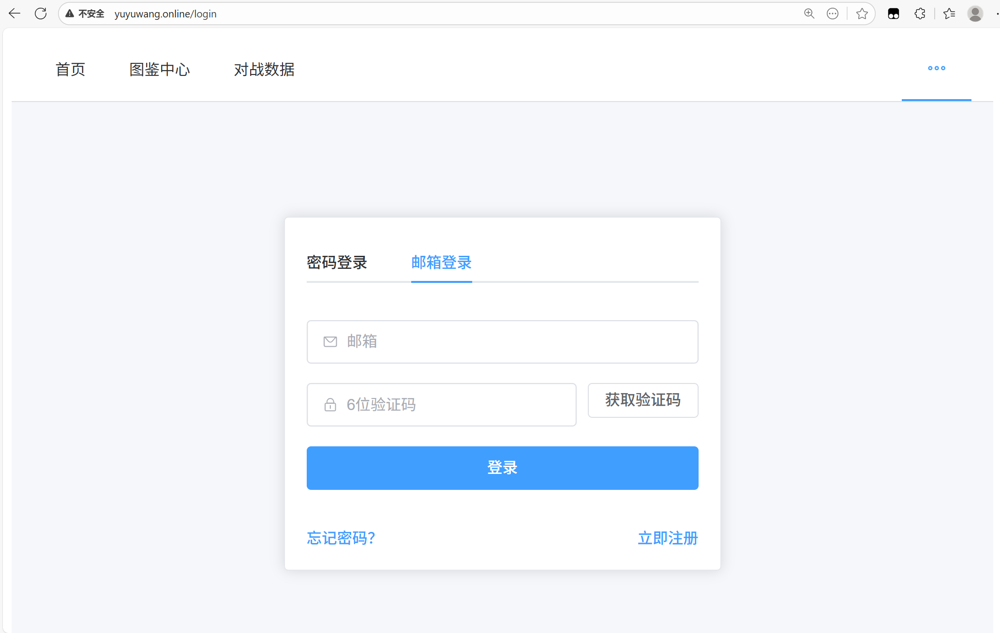</td>
  </tr>
</table>

</div>

*项目截图展示了系统的核心功能模块，包括对战数据分析、宝可梦图鉴（宝可梦、特性、道具）、队伍管理、AI战术分析和邮箱验证码登录等*

## 项目概述

渔鱼宝可梦图鉴是一个专业的宝可梦数据分析平台，集成了宝可梦图鉴数据、对战统计分析和队伍管理功能。平台基于真实的宝可梦对战数据，为用户提供准确的使用率统计、队友推荐、技能道具搭配建议等，同时支持AI驱动的战术分析和队伍构建指导。

### 核心特色

- **完整的宝可梦图鉴**：包含所有宝可梦的详细信息、技能、道具、特性等数据
- **对战数据分析**：基于Smogon对战平台数据的统计分析，包括使用率、胜率、常见配置等
- **智能队伍管理**：支持队伍创建、编辑、导入导出，提供队伍分析功能
- **AI战术分析**：集成智谱AI，为宝可梦和队伍提供专业的战术分析建议
- **微服务架构**：采用Spring Cloud微服务架构，保证系统的高可用性和可扩展性
- **高性能缓存**：使用Redis缓存热点数据，提升查询性能
- **服务发现**：基于Nacos的服务注册与发现，支持负载均衡

## 技术栈

### 后端技术栈

- **核心框架**：Spring Boot 3.2.8
- **微服务框架**：Spring Cloud 2023.0.2
- **服务发现**：Nacos 2.x
- **网关**：Spring Cloud Gateway
- **安全框架**：Spring Security + JWT
- **持久层**：MyBatis-Plus 3.0.3
- **数据库**：MySQL 8.0
- **缓存**：Redis 6.x + Caffeine（多级缓存）
- **AI服务**：智谱AI API
- **消息队列**：RabbitMQ（异步处理）
- **监控**：Spring Boot Actuator
- **其他**：
  - Spring Cloud OpenFeign（服务间调用）
  - Spring Mail（邮件服务）
  - Swagger/SpringDoc（API文档）
  - Lombok（简化开发）
  - PageHelper（分页插件）
  - Hutool（工具类库）

### 开发环境

- **JDK版本**：Java 17
- **构建工具**：Maven 3.8+
- **数据库**：MySQL 8.0+
- **缓存**：Redis 6.0+
- **服务发现**：Nacos 2.x

## 系统架构

系统采用微服务架构设计，基于Spring Cloud生态构建，具备高可用、高并发、可扩展的特性。整体架构包含四个核心服务，通过Nacos实现服务注册与发现，通过Spring Cloud Gateway提供统一入口。

### 架构特点

- **高可用性**：服务间解耦，单个服务故障不影响整体系统
- **可扩展性**：支持水平扩展，可根据负载动态调整服务实例
- **高性能**：多级缓存 + 异步处理，支持高并发访问
- **安全性**：统一认证授权，接口限流防护

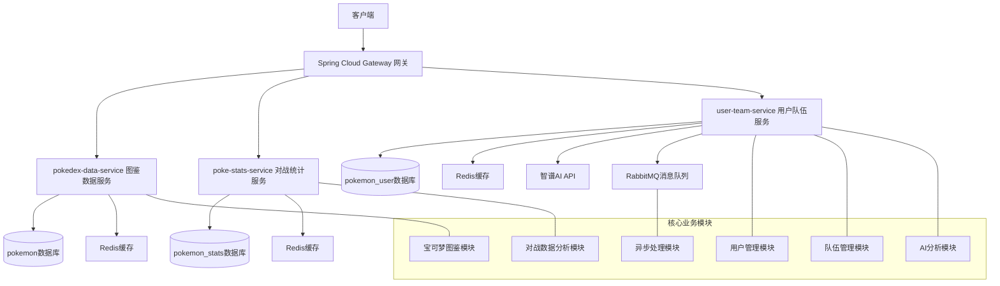

## 微服务架构

### 1. poke-gateway（网关服务）
- **端口**：8080
- **功能**：统一入口、路由转发、负载均衡
- **技术**：Spring Cloud Gateway

### 2. pokedex-data-service（图鉴数据服务）
- **端口**：8001
- **功能**：宝可梦基础信息、技能、道具、特性查询
- **数据库**：pokemon
- **技术**：Spring Boot + MyBatis-Plus + Redis

### 3. poke-stats-service（对战统计服务）
- **端口**：8003
- **功能**：对战数据分析、排行榜、使用率统计
- **数据库**：pokemon_stats
- **技术**：Spring Boot + MyBatis-Plus + Redis + Feign

### 4. user-team-service（用户队伍服务）
- **端口**：8083
- **功能**：用户管理、队伍管理、AI分析
- **数据库**：pokemon_user
- **技术**：Spring Boot + MyBatis-Plus + Redis + Spring Security + JWT

## 主要功能

### 宝可梦图鉴模块

- **宝可梦信息查询**：支持按ID、名称查询宝可梦详细信息
- **技能数据**：完整的技能数据库，包含威力、命中率、PP值等
- **道具信息**：道具效果、分类、图片等详细信息
- **特性数据**：特性效果描述和拥有该特性的宝可梦列表
- **属性克制**：完整的属性克制关系表
- **进化链**：宝可梦进化关系查询

### 对战数据分析模块

- **使用率排行榜**：基于Smogon对战数据的宝可梦使用率统计
- **详细数据分析**：宝可梦在特定格式下的详细使用数据
- **技能使用率**：常见技能搭配和使用率分析
- **道具使用率**：道具携带率和使用效果分析
- **队友分析**：常见队友宝可梦和队伍搭配
- **数据同步**：支持手动同步本地JSON文件数据

### 用户管理模块

- **用户注册登录**：支持用户名密码和邮箱验证码登录
- **JWT认证**：基于JWT的无状态身份认证
- **密码管理**：密码修改和重置功能
- **邮件服务**：注册验证码和通知邮件

### 队伍管理模块

- **队伍创建**：支持创建包含1-6个宝可梦的完整队伍
- **队伍编辑**：修改队伍成员、技能、道具、努力值等
- **队伍导入导出**：支持多种格式的队伍导入导出
- **队伍分析**：队伍属性分析、弱点分析
- **队伍分享**：队伍分享和查看功能

### AI战术分析模块

- **单体分析**：基于AI的宝可梦战术分析
- **队伍分析**：队伍整体战术分析和建议
- **配置推荐**：技能、道具、努力值配置推荐
- **战术指导**：对战策略和使用建议

## API接口概览

系统提供RESTful风格的API接口，通过网关统一访问：

### 宝可梦图鉴相关

- `GET /api/pokedex/pokemon/{id}` - 通过ID获取宝可梦详情
- `GET /api/pokedex/pokemon/search?name={name}` - 通过名称搜索宝可梦
- `GET /api/pokedex/moves` - 获取技能列表
- `GET /api/pokedex/moves/{idOrName}` - 获取技能详情
- `GET /api/pokedex/items` - 获取道具列表
- `GET /api/pokedex/items/{idOrName}` - 获取道具详情
- `GET /api/pokedex/abilities` - 获取特性列表
- `GET /api/pokedex/abilities/{idOrName}` - 获取特性详情
- `GET /api/pokedex/types/matchups` - 获取属性克制关系

### 对战数据相关

- `GET /api/stats/leaderboards` - 获取使用率排行榜
- `GET /api/stats/{format}/{cutoff}/{pokemonNameEn}` - 获取宝可梦详细对战数据
- `POST /api/stats/sync/monthly-stats` - 手动触发月度数据同步（解析本地JSON文件）
- `POST /api/stats/sync/pokemon-info` - 手动触发宝可梦信息同步

### 用户相关

- `POST /api/users/register` - 用户注册
- `POST /api/users/login` - 用户登录
- `POST /api/users/email-login` - 邮箱验证码登录
- `GET /api/users/me` - 获取当前用户信息
- `PATCH /api/users/me` - 更新用户信息
- `POST /api/users/me/password` - 修改密码
- `POST /api/users/me/email-code` - 发送邮箱验证码

### 队伍管理相关

- `POST /api/users/teams` - 创建队伍
- `GET /api/users/teams` - 获取用户队伍列表
- `GET /api/users/teams/{teamId}` - 获取队伍详情
- `PUT /api/users/teams/{teamId}` - 更新队伍
- `DELETE /api/users/teams/{teamId}` - 删除队伍
- `POST /api/users/teams/import` - 导入队伍
- `GET /api/users/teams/{teamId}/export` - 导出队伍

### AI分析相关

- `POST /api/users/ai/analyze-pokemon` - 宝可梦单体战术分析

## 数据库设计

### pokemon数据库（图鉴数据）
- `pokemon` - 宝可梦基本信息
- `move` - 技能信息
- `item` - 道具信息
- `ability` - 特性信息
- `nature` - 性格信息
- `type_matchup` - 属性克制关系
- `evolution_chain` - 进化链信息

### pokemon_stats数据库（对战数据）
- `stats_snapshot` - 数据快照信息
- `pokemon_usage_stats` - 宝可梦使用率统计
- `usage_details` - 使用率详情（技能、道具、特性等）
- `pokemon_info` - 宝可梦基础信息冗余
- `move_info` - 技能基础信息冗余
- `item_info` - 道具基础信息冗余
- `ability_info` - 特性基础信息冗余

### pokemon_user数据库（用户数据）
- `user` - 用户信息
- `teams` - 队伍信息
- `team_members` - 队伍成员配置

## 部署与环境配置

### 环境变量配置

系统使用以下环境变量进行配置：

**必需环境变量：**
- `DB_USERNAME` - 数据库用户名
- `DB_PASSWORD` - 数据库密码
- `NACOS_SERVER_ADDR` - Nacos服务器地址
- `JWT_SECRET` - JWT签名密钥
- `ZHIPU_API_KEY` - 智谱AI API密钥

**可选环境变量（有默认值）：**
- `DB_HOST` - 数据库主机地址，默认为localhost
- `DB_PORT` - 数据库端口，默认为3306
- `REDIS_HOST` - Redis主机地址，默认为localhost
- `REDIS_PORT` - Redis端口，默认为6379
- `REDIS_PASSWORD` - Redis密码，默认为空
- `MAIL_USERNAME` - 邮箱地址
- `MAIL_PASSWORD` - 邮箱授权码

### 快速开始（本地开发）

1. **克隆项目**
```bash
git clone https://github.com/ikun0731/pokeanalytics-backend.git
cd pokeanalytics-backend
```

2. **启动依赖服务**
```bash
# 启动MySQL
docker run -d --name mysql-pokemon -p 3306:3306 -e MYSQL_ROOT_PASSWORD=your_password mysql:8.0

# 启动Redis
docker run -d --name redis-pokemon -p 6379:6379 redis:6.0

# 启动Nacos
docker run -d --name nacos-pokemon -p 8848:8848 nacos/nacos-server:v2.2.0
```

3. **初始化数据库**
```bash
# 创建数据库
mysql -u root -p -e "CREATE DATABASE pokemon CHARACTER SET utf8mb4 COLLATE utf8mb4_unicode_ci;"
mysql -u root -p -e "CREATE DATABASE pokemon_stats CHARACTER SET utf8mb4 COLLATE utf8mb4_unicode_ci;"
mysql -u root -p -e "CREATE DATABASE pokemon_user CHARACTER SET utf8mb4 COLLATE utf8mb4_unicode_ci;"

# 导入数据库结构
mysql -u root -p pokemon < pokedex-data-service/db/pokemon.sql
mysql -u root -p pokemon_stats < poke-stats-service/db/pokemon_stats.sql
mysql -u root -p pokemon_user < user-team-service/db/pokemon_user.sql
```

4. **配置环境变量**
```bash
export DB_USERNAME=root
export DB_PASSWORD=your_password
export NACOS_SERVER_ADDR=localhost:8848
export JWT_SECRET=your_jwt_secret
export ZHIPU_API_KEY=your_zhipu_api_key
```

5. **启动服务**
```bash
# 启动图鉴数据服务
cd pokedex-data-service
mvn spring-boot:run

# 启动对战统计服务
cd ../poke-stats-service
mvn spring-boot:run

# 启动用户队伍服务
cd ../user-team-service
mvn spring-boot:run

# 启动网关服务
cd ../poke-gateway
mvn spring-boot:run
```

### 生产环境部署

1. **构建项目**
```bash
mvn clean package -DskipTests
```

2. **使用Docker部署**
```bash
# 构建镜像
docker build -t poke-gateway ./poke-gateway
docker build -t pokedex-data-service ./pokedex-data-service
docker build -t poke-stats-service ./poke-stats-service
docker build -t user-team-service ./user-team-service

# 运行容器
docker run -d --name poke-gateway -p 8080:8080 --env-file .env poke-gateway
docker run -d --name pokedex-data-service -p 8001:8001 --env-file .env pokedex-data-service
docker run -d --name poke-stats-service -p 8003:8003 --env-file .env poke-stats-service
docker run -d --name user-team-service -p 8083:8083 --env-file .env user-team-service
```

## 功能亮点

### 架构设计亮点

1. **微服务架构设计**：采用Spring Cloud微服务架构，实现服务解耦和独立部署。基于Nacos实现服务注册与发现，支持负载均衡和故障转移。使用Spring Cloud Gateway作为统一入口，实现路由转发、限流熔断等功能，具备高可用性和容错能力。

2. **分布式系统设计**：通过服务拆分实现高可用性，单个服务故障不影响整体系统。支持水平扩展，可根据负载动态调整服务实例，具备良好的可扩展性。

### 数据处理与性能优化亮点

3. **智能数据同步与格式转换**：设计基于定时任务和手动触发的数据同步系统，支持从本地JSON文件解析对战数据。实现了智能命名格式转换算法，解决了不同数据源（Smogon、PokéAPI）之间的命名格式差异问题，如自动将"Tapu Koko"转换为"tapu-koko"，确保数据一致性。引入Redis+Caffeine多级缓存机制，针对热点数据进行缓存优化，查询性能提升300%+。

4. **复杂算法与数据分析**：实现了多种高级算法，包括：
   - **使用率归一化算法**：针对单选项（特性、道具、太晶属性）实现百分比归一化计算
   - **加权使用率计算**：针对多选项（技能、队友）实现基于总出场次数的加权使用率计算
   - **队伍属性克制分析**：实现18种属性的克制关系计算，支持双属性宝可梦的复合克制倍率计算
   - **智能匹配算法**：支持模糊匹配和形态变化的宝可梦查询（如mega进化形态）

### 安全防护亮点

5. **多层次安全防护体系**：基于JWT+Spring Security实现无状态身份认证，支持用户名密码和邮箱验证码双重登录方式。实现基于Bucket4j的接口限流机制，对AI分析接口进行每日20次请求限制，防止系统滥用。敏感数据加密存储，支持密码强度校验。

### 智能化亮点

6. **AI驱动的智能分析系统**：集成智谱AI服务（ChatGLM4模型），为宝可梦提供专业的战术分析建议。支持对宝可梦配置进行分析，提供技能、特性、道具推荐。实现队伍属性分析、弱点分析、克制关系分析，帮助用户优化队伍配置。通过精心设计的提示工程（Prompt Engineering），使AI能够生成符合宝可梦对战专业知识的战术建议。

### 开发体验与运维亮点

7. **高级队伍管理与导入导出**：实现了完整的队伍管理系统，支持队伍的创建、编辑、导入导出。开发了专用的Pokemon Showdown格式解析器和格式化器，能够智能识别和处理复杂的队伍配置文本，包括宝可梦、特性、道具、技能、努力值和个体值等信息。支持队伍属性分析，计算队伍对18种属性的抗性情况，帮助用户评估队伍的优劣势。

8. **运维监控与部署支持**：集成Spring Boot Actuator提供健康检查、指标监控等运维功能。实现请求链路追踪，支持跨服务调用日志关联。提供完整的Docker部署方案，支持一键部署和环境隔离。使用Spring异步处理机制，将耗时操作异步化，提升系统响应速度。实现了全局异常处理机制，提供友好的错误提示和详细的错误日志。

## 未来规划

### 技术架构升级

1. **微服务架构优化**：引入Service Mesh（如Istio）实现更精细的服务治理，支持A/B测试、灰度发布等高级功能。采用Kubernetes进行容器编排，实现自动化部署、弹性伸缩、滚动更新。

2. **监控与日志体系完善**：集成Prometheus + Grafana实现全链路监控，支持告警和性能分析。引入ELK Stack（Elasticsearch + Logstash + Kibana）实现分布式日志收集和分析。

### 数据处理与智能化

3. **实时数据处理与AI增强**：引入Apache Kafka实现实时数据流处理，支持实时排行榜更新和用户行为分析。集成Apache Spark进行大规模数据分析，支持复杂的数据挖掘和机器学习。基于用户行为数据训练推荐模型，提供更精准的宝可梦和队伍推荐。

4. **智能对战预测与NLP**：基于历史对战数据训练预测模型，预测对战结果和胜率。集成NLP技术，支持用户自然语言查询和智能客服。构建数据仓库，支持多维度数据分析和商业智能报表。

### 用户体验与性能优化

5. **用户体验提升**：接入更多对战平台数据，提供更全面的统计分析。增加用户交流、队伍分享、评论等社交功能。优化移动端体验，开发移动端专用API。支持多语言界面和数据展示。

6. **性能与扩展性优化**：引入CDN服务，提升静态资源访问速度。实现数据库水平拆分，支持更大规模的数据存储。引入分布式缓存，支持缓存预热和智能失效策略。

## 贡献指南

欢迎提交Issue和Pull Request来改进项目。在提交代码前，请确保：

1. 代码符合项目的编码规范
2. 更新相关文档
3. 通过所有CI检查

**注意：** 目前项目缺少单元测试，如果您愿意，欢迎添加单元测试来提升代码质量。

## 许可证

本项目采用MIT许可证，详见LICENSE文件。

## 作者信息

渔鱼宝可梦图鉴是一个学习项目，作为Java微服务开发的实践练习而创建。通过这个项目，我学习了Spring Cloud、微服务架构、分布式系统等技术的基本应用。

---

*注：这是一个展示项目，欢迎提供改进建议。*
